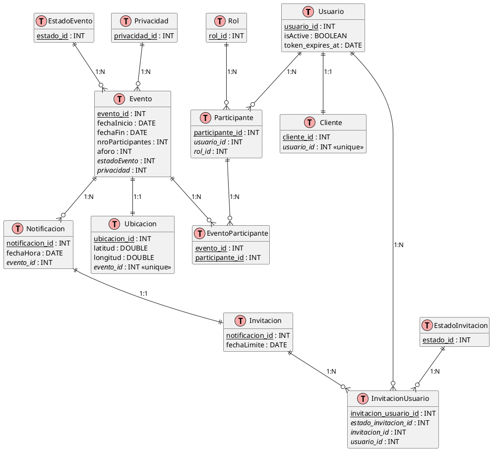

# DIAGRAMA DE CLASES - SISTEMA DE GESTIÓN DE EVENTOS

## 📊 Diagrama Completo del Modelo de Datos

### **Diagrama en Mermaid**

```mermaid
classDiagram
    %% ========== ENTIDADES PRINCIPALES ==========
    
    class Usuario {
        +int usuario_id PK
        +string clave
        +string correo UNIQUE
        +boolean isActive
        +string activation_token
        +date token_expires_at
    }
    
    class Cliente {
        +int cliente_id PK
        +string nombre
        +string apellido
        +int usuario_id FK UNIQUE
    }
    
    class Evento {
        +int evento_id PK
        +string titulo
        +string descripcion
        +date fechaInicio
        +date fechaFin
        +string imagen
        +int nroParticipantes
        +int aforo
        +int estadoEvento FK
        +int privacidad FK
    }
    
    class Participante {
        +int participante_id PK
        +int usuario_id FK
        +int rol_id FK
    }
    
    class Rol {
        +int rol_id PK
        +string nombre UNIQUE
    }
    
    %% ========== RELACIÓN EVENTO-PARTICIPANTE ==========
    
    class EventoParticipante {
        +int evento_id PK, FK
        +int participante_id PK, FK
    }
    
    %% ========== SISTEMA DE NOTIFICACIONES ==========
    
    class Notificacion {
        +int notificacion_id PK
        +date fechaHora
        +int evento_id FK
    }
    
    class Invitacion {
        +int notificacion_id PK, FK
        +date fechaLimite
    }
    
    class InvitacionUsuario {
        +int invitacion_usuario_id PK
        +int estado_invitacion_id FK
        +int invitacion_id FK
        +int usuario_id FK
    }
    
    class EstadoInvitacion {
        +int estado_id PK
        +string nombre UNIQUE
    }
    
    %% ========== CATÁLOGOS ==========
    
    class EstadoEvento {
        +int estado_id PK
        +string nombre UNIQUE
    }
    
    class Privacidad {
        +int privacidad_id PK
        +string nombre UNIQUE
    }
    
    class Ubicacion {
        +int ubicacion_id PK
        +string direccion
        +double latitud
        +double longitud
        +int evento_id FK UNIQUE
    }
    
    %% ========== RELACIONES ==========
    
    %% Usuario - Cliente (1:1)
    Usuario ||--|| Cliente : "tiene perfil"
    
    %% Usuario - Participante (1:N)
    Usuario ||--o{ Participante : "puede ser"
    
    %% Usuario - InvitacionUsuario (1:N)
    Usuario ||--o{ InvitacionUsuario : "recibe"
    
    %% Rol - Participante (1:N)
    Rol ||--o{ Participante : "define"
    
    %% Evento - Participante (N:M a través de EventoParticipante)
    Evento ||--o{ EventoParticipante : "tiene"
    Participante ||--o{ EventoParticipante : "participa en"
    
    %% Evento - Notificacion (1:N)
    Evento ||--o{ Notificacion : "genera"
    
    %% Evento - Ubicacion (1:1)
    Evento ||--|| Ubicacion : "se realiza en"
    
    %% Evento - EstadoEvento (N:1)
    EstadoEvento ||--o{ Evento : "clasifica"
    
    %% Evento - Privacidad (N:1)
    Privacidad ||--o{ Evento : "define tipo"
    
    %% Notificacion - Invitacion (1:1)
    Notificacion ||--|| Invitacion : "puede ser"
    
    %% Invitacion - InvitacionUsuario (1:N)
    Invitacion ||--o{ InvitacionUsuario : "se envía a"
    
    %% EstadoInvitacion - InvitacionUsuario (1:N)
    EstadoInvitacion ||--o{ InvitacionUsuario : "tiene estado"
```

---

## 📋 Descripción de Entidades

### **1. Usuario**
**Propósito:** Almacena credenciales de autenticación.

| Atributo | Tipo | Descripción |
|----------|------|-------------|
| `usuario_id` | INT (PK) | Identificador único |
| `clave` | VARCHAR(20) | Contraseña del usuario |
| `correo` | VARCHAR(30) UNIQUE | Email único |
| `isActive` | BOOLEAN | Cuenta activada |
| `activation_token` | VARCHAR(50) | Token de activación |
| `token_expires_at` | DATE | Expiración del token |

**Relaciones:**
- 1:1 con `Cliente` (perfil personal)
- 1:N con `Participante` (puede tener múltiples roles)
- 1:N con `InvitacionUsuario` (recibe invitaciones)

---

### **2. Cliente**
**Propósito:** Datos personales del usuario.

| Atributo | Tipo | Descripción |
|----------|------|-------------|
| `cliente_id` | INT (PK) | Identificador único |
| `nombre` | VARCHAR(50) | Nombre del cliente |
| `apellido` | VARCHAR(50) | Apellido del cliente |
| `usuario_id` | INT (FK) UNIQUE | Referencia a Usuario |

**Relaciones:**
- N:1 con `Usuario` (un usuario tiene un cliente)

---

### **3. Evento**
**Propósito:** Información de eventos creados.

| Atributo | Tipo | Descripción |
|----------|------|-------------|
| `evento_id` | INT (PK) | Identificador único |
| `titulo` | VARCHAR(30) | Nombre del evento |
| `descripcion` | VARCHAR(300) | Descripción |
| `fechaInicio` | DATE | Fecha de inicio |
| `fechaFin` | DATE | Fecha de fin |
| `imagen` | VARCHAR(200) | URL de imagen |
| `nroParticipantes` | INT | Contador de participantes |
| `aforo` | INT | Capacidad máxima |
| `estadoEvento` | INT (FK) | Estado actual |
| `privacidad` | INT (FK) | Público/Privado |

**Relaciones:**
- N:M con `Participante` (a través de `EventoParticipante`)
- 1:N con `Notificacion` (genera notificaciones)
- 1:1 con `Ubicacion` (tiene ubicación)
- N:1 con `EstadoEvento` (tiene estado)
- N:1 con `Privacidad` (tiene tipo de privacidad)

---

### **4. Participante**
**Propósito:** Representa a un usuario con un rol específico.

| Atributo | Tipo | Descripción |
|----------|------|-------------|
| `participante_id` | INT (PK) | Identificador único |
| `usuario_id` | INT (FK) | Referencia a Usuario |
| `rol_id` | INT (FK) | Rol asignado |

**Relaciones:**
- N:1 con `Usuario` (un usuario puede tener múltiples participantes)
- N:1 con `Rol` (cada participante tiene un rol)
- N:M con `Evento` (a través de `EventoParticipante`)

**Nota:** Un usuario puede ser Organizador en un evento y Asistente en otro.

---

### **5. EventoParticipante (Tabla Intermedia)**
**Propósito:** Relaciona eventos con participantes (N:M).

| Atributo | Tipo | Descripción |
|----------|------|-------------|
| `evento_id` | INT (PK, FK) | Referencia a Evento |
| `participante_id` | INT (PK, FK) | Referencia a Participante |

**Relaciones:**
- N:1 con `Evento`
- N:1 con `Participante`

---

### **6. Rol**
**Propósito:** Define tipos de participantes (Organizador, Asistente).

| Atributo | Tipo | Descripción |
|----------|------|-------------|
| `rol_id` | INT (PK) | Identificador único |
| `nombre` | VARCHAR(20) UNIQUE | Nombre del rol |

**Valores típicos:** "Organizador", "Asistente"

**Relaciones:**
- 1:N con `Participante`

---

### **7. Notificacion**
**Propósito:** Notificaciones generadas por eventos.

| Atributo | Tipo | Descripción |
|----------|------|-------------|
| `notificacion_id` | INT (PK) | Identificador único |
| `fechaHora` | DATE | Fecha de creación |
| `evento_id` | INT (FK) | Evento asociado |

**Relaciones:**
- N:1 con `Evento`
- 1:1 con `Invitacion` (puede ser invitación)

---

### **8. Invitacion**
**Propósito:** Invitaciones específicas a eventos.

| Atributo | Tipo | Descripción |
|----------|------|-------------|
| `notificacion_id` | INT (PK, FK) | Referencia a Notificación |
| `fechaLimite` | DATE | Fecha límite para responder |

**Relaciones:**
- 1:1 con `Notificacion` (hereda PK)
- 1:N con `InvitacionUsuario` (se envía a múltiples usuarios)

---

### **9. InvitacionUsuario**
**Propósito:** Invitaciones enviadas a usuarios específicos.

| Atributo | Tipo | Descripción |
|----------|------|-------------|
| `invitacion_usuario_id` | INT (PK) | Identificador único |
| `estado_invitacion_id` | INT (FK) | Estado actual |
| `invitacion_id` | INT (FK) | Invitación asociada |
| `usuario_id` | INT (FK) | Usuario invitado |

**Relaciones:**
- N:1 con `Invitacion`
- N:1 con `Usuario`
- N:1 con `EstadoInvitacion`

---

### **10. EstadoInvitacion**
**Propósito:** Estados de invitaciones (Pendiente, Aceptada, Rechazada).

| Atributo | Tipo | Descripción |
|----------|------|-------------|
| `estado_id` | INT (PK) | Identificador único |
| `nombre` | VARCHAR(20) UNIQUE | Nombre del estado |

**Valores típicos:** "Pendiente", "Aceptada", "Rechazada"

**Relaciones:**
- 1:N con `InvitacionUsuario`

---

### **11. Ubicacion**
**Propósito:** Ubicación geográfica del evento.

| Atributo | Tipo | Descripción |
|----------|------|-------------|
| `ubicacion_id` | INT (PK) | Identificador único |
| `direccion` | VARCHAR(200) | Dirección textual |
| `latitud` | DOUBLE | Coordenada latitud |
| `longitud` | DOUBLE | Coordenada longitud |
| `evento_id` | INT (FK) UNIQUE | Evento asociado |

**Relaciones:**
- 1:1 con `Evento`

---

### **12. EstadoEvento**
**Propósito:** Estados de eventos (Programado, En curso, Finalizado).

| Atributo | Tipo | Descripción |
|----------|------|-------------|
| `estado_id` | INT (PK) | Identificador único |
| `nombre` | VARCHAR(20) UNIQUE | Nombre del estado |

**Valores típicos:** "Programado", "En curso", "Finalizado", "Cancelado"

**Relaciones:**
- 1:N con `Evento`

---

### **13. Privacidad**
**Propósito:** Tipo de privacidad del evento (Público, Privado).

| Atributo | Tipo | Descripción |
|----------|------|-------------|
| `privacidad_id` | INT (PK) | Identificador único |
| `nombre` | VARCHAR(20) UNIQUE | Tipo de privacidad |

**Valores típicos:** "Público", "Privado"

**Relaciones:**
- 1:N con `Evento`

---

## 🔗 Resumen de Cardinalidades

| Relación | Tipo | Descripción |
|----------|------|-------------|
| Usuario ↔ Cliente | 1:1 | Un usuario tiene un perfil de cliente |
| Usuario ↔ Participante | 1:N | Un usuario puede tener múltiples roles |
| Usuario ↔ InvitacionUsuario | 1:N | Un usuario recibe múltiples invitaciones |
| Rol ↔ Participante | 1:N | Un rol puede tener múltiples participantes |
| Evento ↔ Participante | N:M | Relación muchos a muchos |
| Evento ↔ Notificacion | 1:N | Un evento genera múltiples notificaciones |
| Evento ↔ Ubicacion | 1:1 | Un evento tiene una ubicación |
| Evento ↔ EstadoEvento | N:1 | Múltiples eventos con mismo estado |
| Evento ↔ Privacidad | N:1 | Múltiples eventos con misma privacidad |
| Notificacion ↔ Invitacion | 1:1 | Una notificación puede ser invitación |
| Invitacion ↔ InvitacionUsuario | 1:N | Una invitación se envía a múltiples usuarios |
| EstadoInvitacion ↔ InvitacionUsuario | 1:N | Un estado para múltiples invitaciones |

---

## 📐 Diagrama PlantUML (Alternativo)



---

## 🎯 Notas de Diseño

### **Patrón de Herencia: Notificacion → Invitacion**
- `Invitacion` hereda la PK de `Notificacion`
- Permite extensibilidad para otros tipos de notificaciones (Recordatorio, Alerta)
- Implementa patrón **Factory Method** en el código

### **Tabla Intermedia: EventoParticipante**
- Resuelve relación N:M entre `Evento` y `Participante`
- PK compuesta: `(evento_id, participante_id)`
- Permite que un usuario participe en múltiples eventos con diferentes roles

### **Separación Usuario-Cliente**
- `Usuario`: Datos de autenticación
- `Cliente`: Datos personales
- Cumple **Single Responsibility Principle**

### **Catálogos (Lookup Tables)**
- `Rol`, `EstadoEvento`, `EstadoInvitacion`, `Privacidad`
- Valores predefinidos en seeders
- Facilita mantenimiento y extensibilidad
